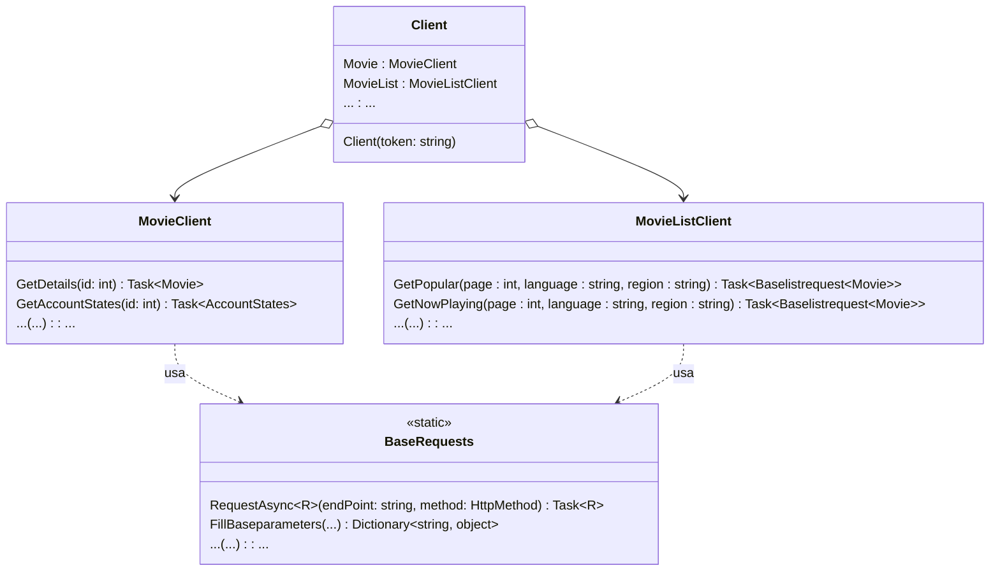

```mermaid
classDiagram
    class Client {
        Client(token: string)
        Movie : MovieClient
        MovieList : MovieListClient
        ... : ...
    }

    class MovieListClient {
        GetPopular(page : int,  language : string, region : string) Task~Baselistrequest~Movie~~
        GetNowPlaying(page : int,  language : string, region : string) Task~Baselistrequest~Movie~~
        ...(...) : ...
    }

    class MovieClient {
        GetDetails(id: int) Task~Movie~
        GetAccountStates(id: int) Task~AccountStates~
        ...(...) : ...
    }

    class BaseRequests {
        <<static>>
        RequestAsync~R~(endPoint: string, method: HttpMethod) Task~R~
        FillBaseparameters(...) Dictionary~string, object~
        ...(...) : ...
    }

    Client o--> MovieClient
    Client o--> MovieListClient
    MovieClient ..> BaseRequests : usa
    MovieListClient ..> BaseRequests : usa
```